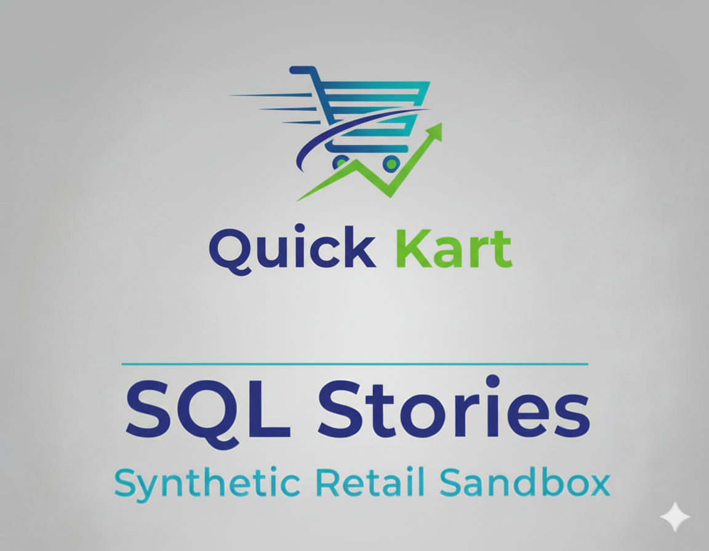

<p align="center">
  
  <br>
  <em>SQL Stories - Case Study Showcase</em>
</p>

<p align="center">
  
  
  
</p>

## 📚 SQL Stories - Case Study Showcase

This repository serves as a collection of end-to-end data analysis case studies. Each "story" simulates a real-world business problem and showcases a full analytical workflow, from understanding the stakeholder's request to building the data pipeline and delivering actionable insights.

The projects are powered by a custom, open-source [data generator](https://github.com/G-Schumacher44/ecom_sales_data_generator) that produces realistic e-commerce data, complete with the kind of "messiness" found in production systems.

## 🧩 TL;DR

- This repository contains two complete, end-to-end data analysis case studies.
- All data is generated by a [custom Python data generator](https://github.com/G-Schumacher44/ecom_sales_data_generator).
- Each case study includes a business brief, SQL code, an automated data pipeline, and stakeholder-ready deliverables (reports, notebooks, dashboards).
- **Story 01 (Inventory Audit)** and **Story 02 (Customer Retention)** are the primary, completed portfolio pieces.
- **Stories 3-5** are currently in development and will be added upon completion.

---

### ▶️ Where to Start

This repository contains two complete case studies. Each demonstrates a full analytical workflow, from business framing to technical execution and stakeholder-ready deliverables.

*   **Case Study 1: [Inventory Audit & Efficiency Analysis](story_01_inventory_audit/story_01_portfolio_readme.md)**
    *   **Focus:** Operational Analytics, Financial Impact
    *   **Summary:** A deep-dive into inventory management that quantifies $19M in locked capital, identifies at-risk SKUs with a custom scoring system, and provides an interactive workbook for business users.

*   **Case Study 2: [Customer Retention & Lifecycle Snapshot](story_02_customer_retention_snapshot/story_02_portfolio_readme.md)**
    *   **Focus:** Growth Analytics, Customer Segmentation
    *   **Summary:** An analysis of customer retention dynamics, identifying key churn drivers, high-value customer segments, and channel performance using cohort analysis and data visualization.

*   **In Development: Stories 3-5**
    *   **Focus:** Upcoming case studies will explore product profitability, operational impact analysis, and ad-hoc executive requests.
    *   **Status:** These scenarios are currently under development and will be added as they are completed.

---

> 📝 **Note for Portfolio Reviewers**
>
> This repository is designed to showcase a mature, end-to-end analytical process. It goes beyond simple SQL queries to demonstrate how I approach real-world business problems.
>
> Across these case studies, you will see:
> - **Strategic Business Framing:** The ability to translate ambiguous business needs (e.g., "improve efficiency") into concrete, measurable analytical objectives.
> - **Robust Technical Execution:** A full-stack data workflow, including complex SQL for data transformation, a Python-powered data pipeline for automation, and data visualization in notebooks and spreadsheets.
> - **Systematic Thinking:** The development of "Engineered Analytical Frameworks"—like the *Attention Flag System* in Story 01—that turn one-off analyses into scalable, reusable solutions.
> - **Clear Stakeholder Communication:** Deliverables tailored to different audiences, from executive summaries to interactive dashboards for business users, and detailed technical handoffs for peers.
>
> Together, these projects demonstrate versatility across different business domains (Operations vs. Growth) and a focus on delivering actionable, data-driven insights that have a measurable impact.


## 🧭 Orientation & Getting Started

<details>
<summary><strong>🧠 Notes from the Analyst</strong></summary>
<br>

**Perpetual Education**

This project started as a way to reinforce and build on my *SQL* skillset and has turned into a full ecosystem spanning multiple repositories, each handling a specific task from data engineering to analysis. I have learned and continue to learn from this ongoing experience.
<br><br>
This repository is a showcase of my continuing journey into Data Analysis. It demonstrates that I have built the skillset to be an asset and the understanding of how to make it valuable.
<br><br>

</details>

<details>
<summary><strong>🗺️ About the Project Ecosystem</strong></summary>

This repository is one part of a larger, interconnected set of projects. Here’s how they fit together:

* **[`ecom_sales_data_generator`](https://github.com/G-Schumacher44/ecom_sales_data_generator)** `(The Engine)`  
  Generates realistic, relational ecommerce datasets. This extension imports it and keeps that repo focused on synthesis.
* **[`ecom-datalake-exten`](https://github.com/G-Schumacher44/ecom-datalake-exten)** `(The Lake Layer)`  
  Converts generator output to Parquet, attaches lineage, and publishes to raw/bronze buckets.
* **[`sql_stories_skills_builder`](https://github.com/G-Schumacher44/sql_stories_skills_builder)** `(Learning Lab)`  
  Publishes the story modules and exercises that use these datasets for hands-on practice.
* **[`sql_stories_portfolio_demo`](https://github.com/G-Schumacher44/sql_stories_portfolio_demo/tree/main)** `(The Showcase - This respository)`  
  Curates the best case studies into a polished portfolio for professional storytelling.
* **gcs-automation-project** `(In Development · The Orchestrator)`  
  Planned orchestration layer for scheduling backlog runs, triggering BigQuery loads/merges, and coordinating downstream DAGs.

</details>

</details>

<details>
<summary>📐 What’s Included</summary>

*   **Two Completed Case Studies**: Full end-to-end workflows for  
    - [`story_01_inventory_audit`](story_01_inventory_audit/story_01_portfolio_readme.md)  
    - [`story_02_customer_retention_snapshot`](story_02_customer_retention_snapshot/story_02_portfolio_readme.md)

*   **Pre-built Databases**: Packaged in  
    - [`ecom_data_gen_output/database.zip`](ecom_data_gen_output/database.zip), including  
      - [`ecom_retailer.db`](ecom_retailer.db) (for stories 1 & 2)  
      - [`ecom_retailer_v3.db`](ecom_retailer_v3.db) (for future stories).

*   **Automated Data Pipeline**: A system to execute SQL and upload results to Google Sheets.  
    - [`run_story.sh`](run_story.sh): The main pipeline orchestrator.  
    - [`scripts/g_drive_uploader.py`](scripts/g_drive_uploader.py): Upload script for Google Drive/Sheets.  
    - Configuration templates:  
      - [`secrets_template.yaml`](secrets_template.yaml)  
      - [`stories_config_template.yaml`](stories_config_template.yaml)  
    - A detailed [USAGE.md](USAGE.md) guide.

*   **Utility Scripts**:  
    - [`scripts/check_db.py`](/scripts/check_db.py): Validate the database schema.  
    - [`scripts/csv_to_xlsx.py`](/scripts/csv_to_xlsx.py): Convert CSV files to `.xlsx` format.

*   **Project Documentation**:  
    - [`storycrafting.md`](storycrafting.md): Internal design doc explaining how stories are framed.  
    - [`sample_ai_prompt.md`](sample_ai_prompt.md): Guide for using AI to generate new scenarios.

> 🚫 Not included in this repo: the data generator itself — that's housed in [`ecom_sales_data_generator`](https://github.com/G-Schumacher44/ecom_sales_data_generator).

</details>

<details>
<summary><strong>🫆 Version Release Notes</strong></summary>

**v0.2.0 - Portfolio Release**
- Stories 1 & 2 are now complete, end-to-end case studies.
- Story Module 5 has been deprecated in this repository.
- The `ecom_retailer.db` (v0.2.5) is the primary database for the live stories.
- Full documentation overhaul for a portfolio-focused presentation.
- Added an automated data pipeline and supporting utility scripts.
- 
**v0.1.0 — Alpha Launch**
- Includes fully built database and `db_builder.zip`
- Five scenarios with ascending complexity (CR 1–5)
- Scenario 5 demo includes full workflow: deliverables, notebooks, exports
- AI-assisted design used for scenario crafting, QA, and documentation
- Includes full storycrafting methodology doc

**Planned for v0.3.0**
- More SQL stories (CR 6 and beyond)
- Richer simulation data: enhanced return logic, behavior, and join depth
- Cohort-specific mess settings (per table)
- Optional notebook integrations and user prompts
- Scenario templating support and QA checklists

> Targeting alignment with `ecom_sales_data_generator` enhancements to support layered realism

</details>

<details>
<summary>⚙️ Project Structure</summary>

---

```text
sql_stories_portfolio_demo/
│   ├── ecom_data_gen_output/
│   │   └── database.zip              # Zipped database files
│   ├── creds/
│   │   └── sheets_creds_template.json # Template for G-Sheets credentials
│   ├── scripts/
│   │   ├── g_drive_uploader.py        # Upload query results to Google Drive
│   │   ├── check_db.py                # Validate SQLite database integrity
│   │   └── csv_to_xlsx.py             # Convert CSV outputs to Excel
│   ├── repo_files/
│   │   └── dark_logo_banner.png       # Project branding asset
│   ├── story_01_inventory_audit/
│   │   └── story_01_portfolio_readme.md # Case study entry point
│   ├── story_02_customer_retention_snapshot/
│   │   └── story_02_portfolio_readme.md # Case study entry point
│   ├── story_03_product_profitability_review/
│   │   └── (In Development)
│   ├── story_04_cart_behavior_analysis/ # (Planned)
│   └── story_05_product_vp_request/   # (Planned)
│
├── ecom_retailer.db                   # Pre-built SQLite DB for stories 1 & 2
├── README.md                          # Main project introduction
├── secrets_template.yaml              # Template for pipeline secrets
├── stories_config_template.yaml       # Template for story-specific configs
├── run_story.sh                       # Master script to run the pipeline
├── USAGE.md                           # Detailed usage guide
├── requirements.txt                   # Python dependency list
└── storycrafting.md                   # Internal design + methodology notes
```
</details>

<details>

<summary>💡 Sample AI Prompt for Scenario Design</summary>

Use this data generator alongside AI to create realistic business analysis scenarios. For the best results, upload your generated database to enable context-aware assistance.

```text
I have a synthetic e-commerce dataset with tables for orders, returns, customers, and products. 
Please help me design a business scenario that reflects a real-world problem an analyst might face.

Include a short background, 2–3 guiding business questions, and examples of SQL queries that could help answer them.
```

</details>

___

### 🛠 Environment Setup

To get started with the project, install dependencies using one of the following methods:

**Option 1: Conda (Recommended)**
Use the full environment specification:

```bash
conda env create -f environment.yml
conda activate sql_stories
```
**Option 2: pip install**

```bash
pip install -r requirements.txt
```

📦 The environment.yml includes tools for working with Jupyter, SQLite, Google Sheets, and testing — ideal for full local development.
___

## 🤝 On Generative AI Use

Generative AI tools (including models from Google and OpenAI) were used throughout this project as part of an integrated workflow — supporting code generation, documentation refinement, and idea testing. These tools accelerated development, but the logic, structure, and documentation reflect intentional, human-led design. This repository reflects a collaborative process where automation supports clarity and iteration deepens understanding.


## 📦 Licensing

This project is licensed under the [MIT License](LICENSE).</file>

---

<p align="center">
  <a href="README.md">🏠 <b>Main README</b></a>
  &nbsp;·&nbsp;
  <a href="USAGE.md">📖 <b>Usage Guide</b></a>
  &nbsp;·&nbsp;
  <a href="story_01_inventory_audit/story_01_portfolio_readme.md">📦 <b>Case Study: Inventory Audit</b></a>
  &nbsp;·&nbsp;
  <a href="story_02_customer_retention_snapshot/story_02_portfolio_readme.md">💡 <b>Case Study: Customer Retention</b></a>
</p>

<p align="center">
  <sub>✨ SQL · Python · Storytelling ✨</sub>
</p>