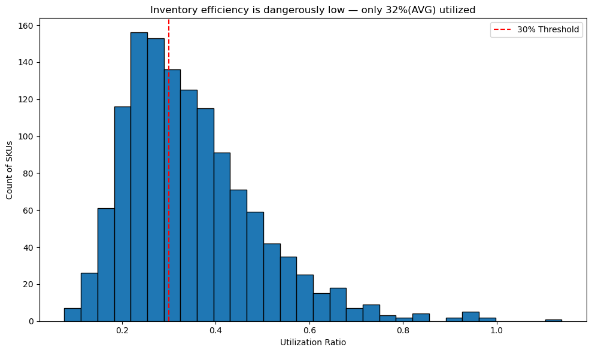
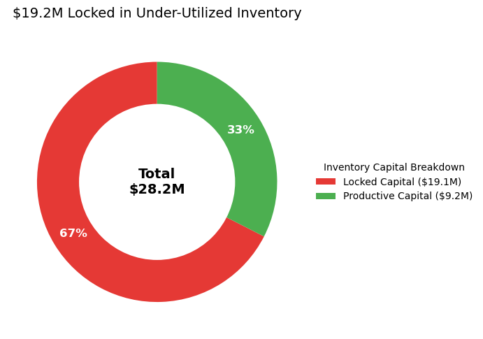
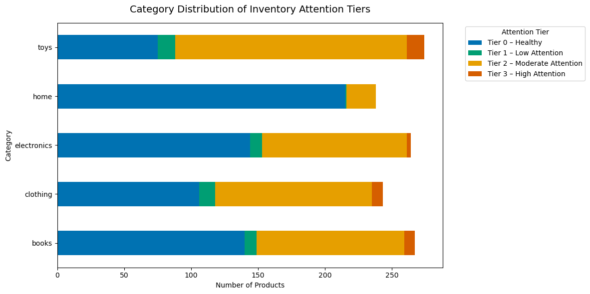
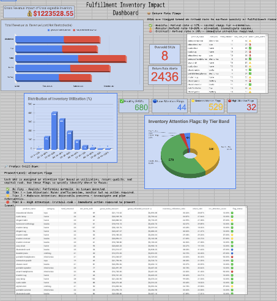

# 📦 Executive Summary – Scenario 01: Inventory Accuracy

This diagnostic assesses **the Fulfillment Team's** request to audit their systems and surface key insights. It evaluates catalog-wide utilization, identifies SKU-level risks, and quantifies capital locked in slow-moving stock. Findings highlight inefficiencies, their impact on working capital and carrying costs, and exposure at the category level—framing clear priorities for corrective action.

---

## 📊 KPI Snapshot

| Metric                          | Value  |
| ------------------------------- | ------ |
| Total SKUs                      | 1286   |
| Under-Utilized SKUs (<30%)      | 562    |
| Oversold SKUs                   | 8      |
| High Attention Flagged Skus     | 32     |
| Moderate Attention Flagged Skus | 530    |
| Estimated Capital Tied Up       | $19.1M |

---

## 🧠 Key Insights

### **🚨 Catalog-wide inventory efficiency is dangerously low — only 56% utilized:** Average utilization is only ~56%, which is a red flag. This indicates a large share of capital is tied up in slow-moving stock, and under-performing SKUs are evenly distributed across categories rather than isolated to a single problem area.  

  

     
    <em>Launch SKU rationalization and demand-based purchasing to lift utilization above 70%.</em>
  

### **🚨 $19.1M capital lock-up in under‑utilized inventory:** This represents working capital tied up in excess units (valued at unit price), resulting in a significant carrying cost burden. A 20% reduction frees ~$3.8M and reduces annual carrying costs by $0.8–$1.1M (assuming 20–30% carrying rates).

  

     
    <em>Reduce excess units by 20% to free ~$3.8M in working capital and lower annual carrying costs by $0.8M–$1.1M.</em>
  

### **⚠️ Risk is spread across categories with “Moderate Attention” dominating:** No single category is disproportionately risky; moderate attention flagged SKUs hover around ~40–50% across all categories.  Home however is the least risky, as 90% of SKUS are flagged as Healthy

  

     
    <em>Focus on improving "Moderate Attention" SKUs through better forecasting, clearance, and promotional strategies, while maintaining category balance.</em>
  

>>Tiering Guide(based on weighted scoring system): <0.20 = ✅ Healthy · 0.20–0.50 = 🔵 Low · 0.50–0.80 = 🟡 Moderate · ≥0.80 = 🔴 High
---

### 📝 Recommendations

Based on these findings, the following actions are recommended:

1.  **Immediate Triage of Tier 2 & 3 SKUs:**
    *   Launch an immediate, in-depth review of all Atention Flagged - Tier 2 & 3 products.
    *  🚨 Focus on SKUs that have high return rates, as these pose the greatest risk to customer satisfaction and profitability.(flagged in accompanying workbook) 
    *  💰 Mitigating Tier 2 & 3 risks by 50% could prevent $500k annually in avoidable losses, directly improving margin protection and freeing working capital.

2.  **Category-Level Strategic Review:**
    *   Initiate a targeted review of the categories with the highest concentration of at-risk products.
    *   🚨 Work with category managers to diagnose root causes, which may include refining demand forecasts, reviewing supplier performance, or assessing product-market fit.
    *  💰 Estimated cost savings from improved forecasting and supplier management could reduce excess inventory costs by approximately $1.9M–$3.8M annually (assuming a 10–20% improvement on tied-up capital).

3.  **Address Under-Utilized Inventory:**
    *   🚨 Develop a strategy for products with very low utilization (<30%).
    *   Consider promotional campaigns, markdowns, or bundling to clear excess stock and free up working capital. For chronically poor performers, evaluate delisting.
    *   💰 At standard carrying cost rates, the $19.2M tied up translates into $3.9M–$5.8M in annual costs. Even a 20% improvement could recover $770K–$1.15M annually..

4.  **Improve Data Governance:**
    *   ⚠️ Investigate the root cause of data anomalies found in the audit.
    *   Strengthen data validation rules at the point of entry to prevent impossible values and ensure the reliability of inventory data for future analysis and operations.
    *   💰 Enhancing data quality will improve decision-making accuracy and reduce costly errors. 

___

## Key Deliverables

- **Executive Summary (this document):** High-level narrative of findings, risks, and recommendations for stakeholders.  
- **Interactive Workbook (Excel/Google Sheets):** Drill-down tool with pivot tables and filters to explore utilization, locked capital, and returns by SKU/category.
  - Live version: [Inventory Audit Workbook – Google Sheets](https://docs.google.com/spreadsheets/d/1PuANFstg9yOWV84X1mOoblQp4ProvaSo4iYJ1ONZM7k/edit?gid=2045234789#gid=2045234789)  
- **SQL Audit View (`build_inventory_audit_view.sql`):** Core script consolidating product, sales, and returns data into the inventory audit view with KPIs and flags.  
- **EDA Scripts (`eda_inv_audit.sql`, `eda_inv_audit_viz.sql`):** Supporting SQL for exploratory analysis and visualizations of patterns and anomalies.   
- **Executive Report Notebook (`exec_report_viz.ipynb`):** Supplementary Python/Jupyter assets to reproduce and extend the visuals.

___

## 📑 Workbook Overview

  

The **Inventory Audit Workbook** is designed as the primary interactive tool for exploring results.  
It includes:

- **Drill-Down Views:** SKU-level detail with filters for category, tier flag, and utilization ratio.  
- **Pivot Tables & Calculated Fields:** Highlight locked capital, non-restockable losses, and utilization efficiency by product or category.  
- **Attention Flag Score (✅ 🔵 🟡 🔴)**: Weighted composite of utilization, return rates, and locked capital — providing a single, at-a-glance risk tier.
  - **Flag Tiering Guide:** <0.20 = ✅ Healthy · 0.20–0.50 = 🔵 Low · 0.50–0.80 = 🟡 Moderate · ≥0.80 = 🔴 High
-  **Return Rate Flags:** ≤ 0.12 = ✅, 0.12–0.20 = ⚠️, > 0.20 = 🚨
-  **Utilization Ratio Flags:** ≤ 0.30 = ✅, > 0.30 = 🚨
- **Capital & Loss Estimates:** Built-in formulas to translate utilization gaps and returns into financial exposure.  
- **Refresh Scaffold:** A Google Apps Script button is scaffolded for data refresh; future iterations may automate this fully.

#### 📌 How the Attention Score Works

To prioritize which SKUs demand action, we designed a weighted scoring system that blends three diagnostic signals:

- Low Utilization → Flags items with excess stock sitting idle (utilization below 30%).
- High Return Rate → Highlights products with frequent customer returns (≥ 30%).
- Volume Sensitivity → Applies extra weight to lower-volume SKUs so that issues with smaller denominators aren’t overlooked.

These signals are combined into a *composite score between 0 and 1*. Products with higher scores indicate stronger red flags and are automatically grouped into four tiers **(Healthy → High Risk)**. This makes it easy for business users to focus on the most critical inventory problems first, while still keeping visibility on emerging risks across the full catalog.

>This workbook serves as the operational layer of the project, giving fulfillment and category managers a way to prioritize SKUs, quantify impacts, and monitor improvements over time.

---

# 📤 In Closing

This audit provides a clear, evidence‑based view of inventory challenges and opportunities. By applying the proposed tiered approach, the business can shift from reactive to proactive inventory management. Prioritizing high‑risk SKUs and addressing under‑utilization will release tied‑up capital, lower carrying costs, and streamline operations. Executing these actions will strengthen working capital, supplier performance, and customer satisfaction, delivering measurable financial and operational gains.

>>*Portfolio Reveiwers:*
>>This case study demonstrates how structured analysis can transform raw data into actionable business insights. By highlighting key risks, quantifying financial impacts, and recommending prioritized interventions, the project shows how data storytelling can drive meaningful improvements in inventory management. The work illustrates not only technical proficiency in data analysis but also the ability to frame findings in a way that resonates with decision-makers. For portfolio purposes, it showcases a strong balance between analytical rigor, business impact, and clear communication.

---

  <a href="../../README.md">🏠 <b>Main README</b></a>
  &nbsp;·&nbsp;
  <a href="../../USAGE.md">📖 <b>Usage Guide</b></a>
  &nbsp;·&nbsp;
  <a href="../../story_01_inventory_audit/story_01_portfolio_readme.md">📦 <b>Case Study: Inventory Audit</b></a>
  &nbsp;·&nbsp;
  <a href="../../story_02_customer_retention_snapshot/story_02_portfolio_readme.md">💡 <b>Case Study: Customer Retention</b></a>

  ✨ SQL · Python · Storytelling ✨

