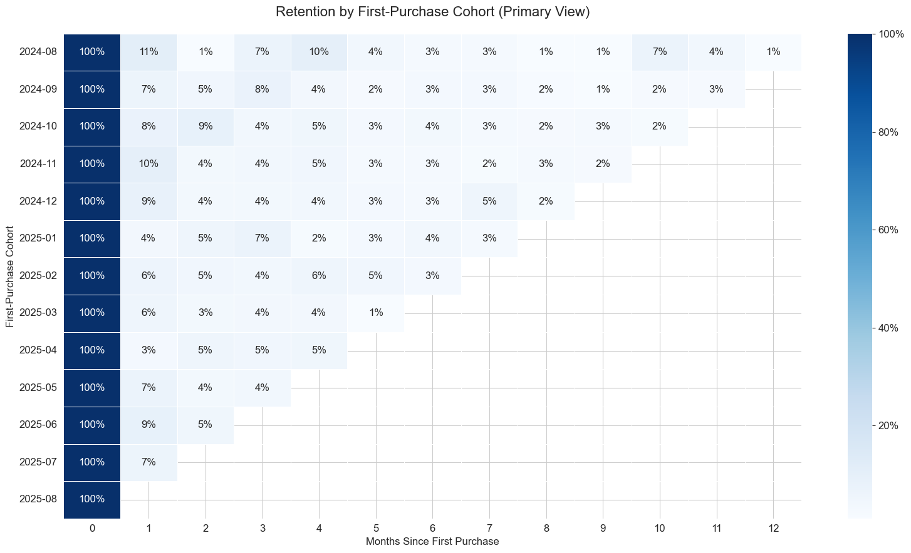
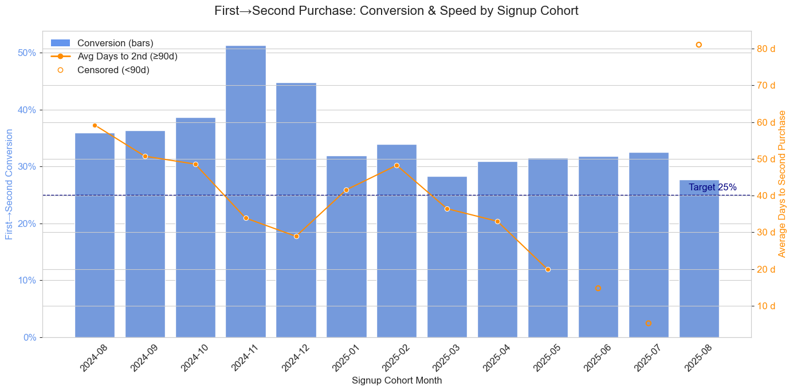
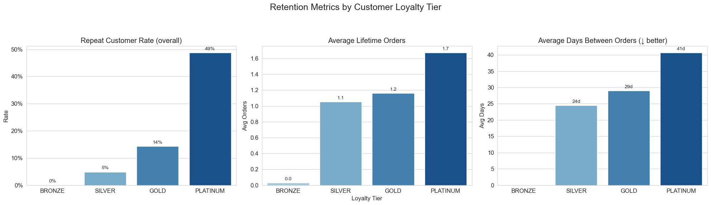
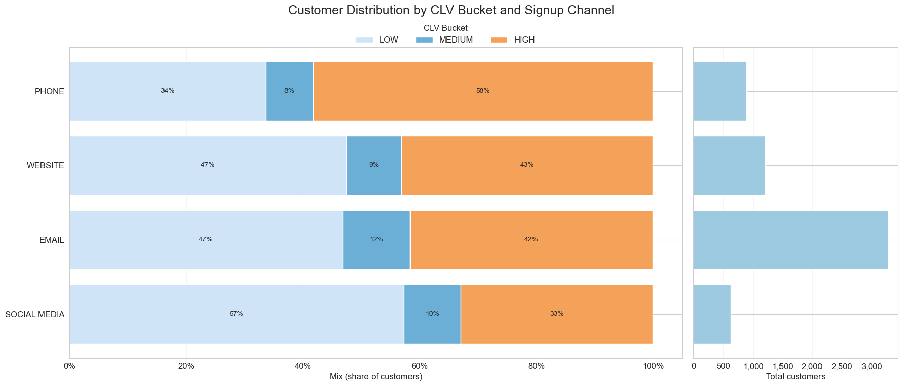

# 🔄 Executive Summary – Scenario 02: Customer Retention

The Marketing Team specifically requested a retention snapshot to guide strategy, recognizing customer retention as a powerful driver of growth and profitability. This snapshot uncovered key opportunities across three core areas: early engagement, seasonal conversion spikes, and loyalty program gaps. Additionally, the analysis surfaced further areas for future exploration, such as channel optimization and customer segmentation. The following report delves into these insights, providing a detailed look at customer segment engagement and actionable recommendations to strengthen loyalty and reduce churn.
The full analysis and visualizations are available in the [`Executive_Retention_Report.ipynb`](https://nbviewer.org/github/G-Schumacher44/sql_stories_portfolio_demo/blob/main/story_02_customer_retention_snapshot/Executive_Retention_Report.ipynb).
___

## 📊 KPI Snapshot

| **Metric**               | **Value/Insight**                                                              |
| ------------------------ | ------------------------------------------------------------------------------ |
| First→Second Conversion  | ~34% average across cohorts; strongest cohorts (Nov/Dec ’24) >50%              |
| Month 1→3 Retention Drop | Decline of ~11 percentage points, highlighting fast early churn                |
| Loyalty Tier Performance | Platinum retains ~45–50%; Bronze shows 0% repeat behavior                      |
| Channel CLV Mix          | Phone drives 58% HIGH CLV; Website/Email ~40% HIGH; Social Media lowest at 33% |

___

## 🧠 Retention Insights & Actions

### 📌 Early Engagement is Key

Cohorts lose approximately 11 percentage points in retention between Month 1 and Month 3, with the highest performing cohorts retaining close to 25% by Month 3, while weaker cohorts like Jan and Apr ’25 drop below 5% repeaters. This significant early decay highlights a critical window to engage customers before they churn.  

  

**Recommendation:** Deploy targeted win-back campaigns within the first 30 days to re-engage at-risk customers, especially focusing on underperforming cohorts like Jan and Apr ’25. Implement A/B tests on different incentive offers and communication channels to identify the most effective tactics for reducing early churn.

---

### 📌 Stable Conversion with Seasonal Spikes

The average first-to-second purchase conversion rate hovers around 34%, but Nov and Dec ’24 cohorts exceed 50%, illustrating a strong holiday effect that boosts initial repeat behavior. This seasonal spike suggests that timing and context significantly influence conversion success.

  

**Recommendation:** Codify the successful elements of the holiday campaigns—such as promotions, bundles, and urgency messaging—and adapt these strategies for other seasonal peaks. Prioritize campaign planning to align with periods of heightened customer activity, and investigate whether these levers could be tailored to drive traffic and conversion during off-season periods with lower volume.

---

### 📌 Loyalty Program Gaps

The Bronze tier, which comprises a substantial portion of the customer base, shows a 0% repeat purchase rate, while Silver and Gold tiers perform below retention benchmarks at ≤15%. In contrast, the Platinum tier retains approximately 45–50% of customers, driving the majority of loyalty program ROI. This disparity indicates that lower tiers are not effectively motivating repeat engagement.  

  

**Recommendation:** Redesign the Bronze and Silver tier benefits to incentivize early repeat purchases with clear, attainable rewards. Simplify tier progression to create a more compelling growth path that encourages customers to advance through the loyalty program, thereby increasing overall retention and lifetime value.

---

### 📌 Channel CLV Mix Shows Clear Winners and Weak Performers

Analysis reveals that the Phone channel drives the highest proportion of high Customer Lifetime Value (CLV) customers at 58%, followed by Website and Email channels each contributing approximately 40% high-CLV customers. In contrast, Social Media underperforms with only 33% high-CLV customers, indicating weaker retention potential from this channel.  

  

**Recommendation:** Develop a strategic channel optimization plan that prioritizes scaling Email marketing efforts to capitalize on its strong CLV performance. Simultaneously, enhance Website SEO and conversion flows to increase high-value customer acquisition and retention. Redefine Social Media’s role to focus primarily on top-of-funnel brand awareness and customer acquisition rather than retention, ensuring resources are allocated efficiently to maximize overall customer lifetime value.

___

## 📦 Key Deliverables

- `sql_sessions/` folder – includes SQL scripts for building cohort, loyalty, and CLV views.
- `../sql_sessions/build_02_retention_views.sql` – main SQL script to create and refresh retention views.
- `../Executive_Retention_Report.ipynb` – full analysis notebook with queries, visuals, and insights.
- `Executive_Retention_Report.html` – HTML version of the full analysis, suitable for non-technical stakeholders.
- `executive_retention_summary.md` – this one-page executive summary for decision-makers.
- `hand_off.md` – hand-off guide for stakeholders and future analysts.

___

# 📤 In Closing

The retention snapshot provides a comprehensive analysis of customer behavior, revealing key opportunities to enhance loyalty and reduce churn through targeted early engagement, seasonal campaign optimization, and loyalty program improvements. These evidence-based insights offer actionable strategies that can drive meaningful business impact by increasing repeat purchase rates and maximizing customer lifetime value.

>Portfolio Reviewers: This case study exemplifies a structured approach to data analysis and storytelling, delivering clear, actionable insights that align with strategic decision-making. It serves as a valuable reference for portfolio review, demonstrating how rigorous evaluation and focused recommendations can support sustained growth and customer retention initiatives.

---

  <a href="../../README.md">🏠 <b>Main README</b></a>
  &nbsp;·&nbsp;
  <a href="../../USAGE.md">📖 <b>Usage Guide</b></a>
  &nbsp;·&nbsp;
  <a href="../../story_01_inventory_audit/story_01_portfolio_readme.md">📦 <b>Case Study: Inventory Audit</b></a>
  &nbsp;·&nbsp;
  <a href="../../story_02_customer_retention_snapshot/story_02_portfolio_readme.md">💡 <b>Case Study: Customer Retention</b></a>

  ✨ SQL · Python · Storytelling ✨

