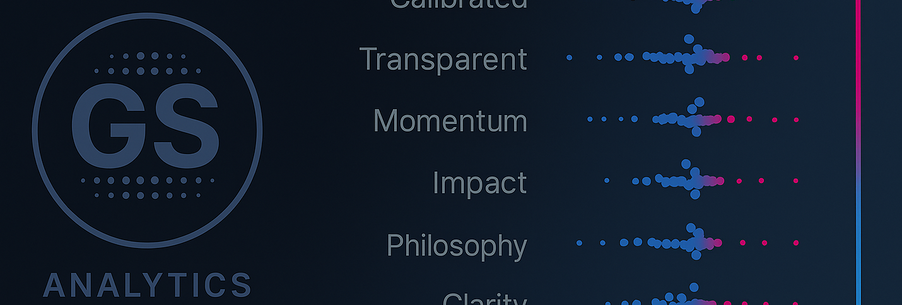

  
   
  <em>Customer Retention Case Study</em>

  
  
  

# 📘 SQL Stories — Story 02: Customer Retention Snapshot

## 🔎 Overview  
This story investigates **customer retention dynamics** for a simulated e-commerce retailer.  
Key risks and opportunities addressed:  
- **Early Churn** → Most customers disengage within the first 60 days.  
- **Conversion to Repeat** → First→second purchase conversion is a leading churn indicator.  
- **Loyalty Program Gaps** → Bronze and Silver tiers underperform, Platinum drives ROI.  
- **Channel Effectiveness** → Organic + Email drive high-CLV customers; Social Media underperforms.  

### ▶️ Where to Start

- **Scenario Brief** → [`scenario_02_retention_snapshot.md`](scenario_02_retention_snapshot.md) - Overview of the simulated business scenario.  
- **Executive Summary (Quick Read)** → [`reports/executive_retention_summary.md`](reports/executive_retention_summary.md) – High-level insights, risks, and recommendations.  
- **SQL Sessions (Deeper Dive)** → [`sql_sessions/`](sql_sessions/) – SQL queries for building retention views and data pipeline.  
- **Analysis Notebook (Full Analysis & Visuals, Primary Deliverable)** → [`Executive_Retention_Report.ipynb`](https://nbviewer.org/github/G-Schumacher44/sql_stories_portfolio_demo/blob/main/story_02_customer_retention_snapshot/Executive_Retention_Report.ipynb)
 – Visual storytelling and diagnostic

 > 📝 **Note for Portfolio Reviewers**  
> This case study is designed to demonstrate how I approach **retention analytics** — from SQL cohort building to business storytelling.  
> 
> What you’ll see here:  
> - **Business Framing** → translating retention into measurable KPIs and drivers.  
> - **Technical Execution** → SQL view creation, cohort analysis, segmentation, and Python visualizations.  
> - **Stakeholder Communication** → executive summary, handoff document, and targeted insights.  
> - **Portfolio Fit** → balances analytical rigor (data validation, KPI snapshots, channel analysis) and business impact (clear recommendations tied to retention levers).  
> 
> This project shows both my **technical proficiency** and my **ability to communicate actionable insights in a business-friendly way**.

___

## 🗂 About the Data  
This analysis is powered by a synthetic e-commerce dataset generated using my custom data generator(v0.2.5, pre-release):  
➡️ [ecom_sales_data_generator](https://github.com/G-Schumacher44/ecom_sales_data_generator)  

The generator simulates realistic customer, order, return, and loyalty program behaviors, allowing for:  
- Cohort and retention analysis across time.  
- Loyalty tier and CLV segmentation.  
- Channel performance benchmarking.  
- Reproducible datasets for training and portfolio storytelling.  

---

## 📐  Analytical Frameworks  

### 🔄 Customer Lifecycle Segmentation Framework
This analysis isn't just a one-off report; it's built on a reusable framework for understanding customer value over time. It segments the customer base into actionable lifecycle stages:

- **Acquisition & Early Engagement:** Measured by monthly cohorts and first-to-second purchase conversion rates. This identifies how effectively we turn new users into repeat customers.
- **Value-Based Segmentation:** Leverages pre-existing loyalty tiers (Bronze → Platinum) and CLV buckets to analyze how retention differs across value segments, pinpointing which groups drive the most long-term value.
- **Channel Performance:** Attributes customer acquisition to specific channels (Email, Social, etc.) to measure the long-term value and retention quality of each.

This framework provides a structured, repeatable way to diagnose retention health, measure the ROI of marketing channels, and guide strategic investments in the customer lifecycle.

---

## 📊 Key Deliverables
- **Executive Summary** → [`reports/executive_retention_summary.md`](reports/executive_retention_summary.md)  
- **Analysis Notebook (Full Analysis & Visuals, Primary Deliverable)** → [`Executive_Retention_Report.ipynb`](https://nbviewer.org/github/G-Schumacher44/sql_stories_portfolio_demo/blob/main/story_02_customer_retention_snapshot/Executive_Retention_Report.ipynb)
&nbsp;
  
---

## 🖼 Visual Artifacts (`files/`)  
- Cohort Heatmap → [Cohort Heatmap](files/heatmap_cohort.png)  
- First→Second Conversion → [Conversion](files/stk_bar_channel.png)  
- Loyalty Tier Bars → [Loyalty Tiers](files/loyalty_tier_bars.png)  
- CLV by Channel → [CLV Channels](files/clv_channel_bar.png)  

---

## 🛠 Technical Components   
- **Handoff Document** → [`reports/hand_off.md`](reports/hand_off.md)   
- **Retention Views Build** → [`build_02_retention_views.sql`](sql_sessions/build_02_retention_views.sql)  
- **Cleanup Scripts** → [`cleanup_02_retention_views.sql`](sql_sessions/cleanup_02_retention_views.sql)  

---

## 🥾 Next Steps  
- Extend retention views into 3rd/4th purchase cohorts.  
- Add demographic segmentation (e.g., age × channel).  
- Explore cart abandonment × CLV.  
- Automate SQL → Sheets refresh for marketing dashboards.  

---

  <a href="../README.md">🏠 <b>Main README</b></a>
  &nbsp;·&nbsp;
  <a href="../USAGE.md">📖 <b>Usage Guide</b></a>
  &nbsp;·&nbsp;
  <a href="../story_01_inventory_audit/story_01_portfolio_readme.md">📦 <b>Case Study: Inventory Audit</b></a>
  &nbsp;·&nbsp;
  <a href="./story_02_portfolio_readme.md">💡 <b>Case Study: Customer Retention</b></a>

  ✨ SQL · Python · Storytelling ✨

